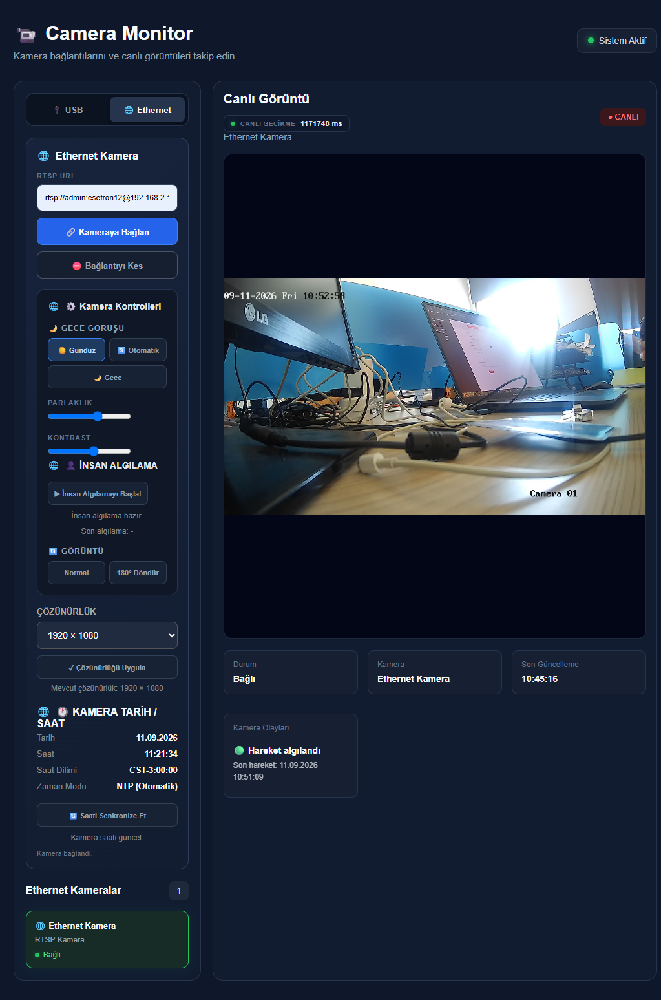

# 📹 Camera Monitor

## 1. Proje Hakkında

Camera Monitor, USB ve Ethernet/IP kameraların canlı görüntüsünün web arayüzü üzerinden izlenmesini ve kamera özelliklerinin bilgisayar üzerinden kontrol edilmesini sağlayan web tabanlı bir kamera izleme uygulamasıdır.

Proje kapsamında USB kameralar tarayıcı üzerinden algılanabilmekte, Ethernet/IP kameralar ise RTSP protokolü üzerinden sisteme bağlanabilmektedir.

Ethernet kamera görüntüsü Node.js ve FFmpeg kullanılarak alınmakta, MPEG-TS formatında tarayıcıya aktarılmakta ve mpegts.js aracılığıyla canlı olarak görüntülenmektedir.

Uygulama ayrıca kamera görüntü ayarları, tarih ve saat bilgisi, NTP senkronizasyonu, gece/gündüz modu, çözünürlük, görüntü döndürme, insan algılama ve kamera olaylarının izlenmesi gibi çeşitli özellikler sunmaktadır.

## 2. Özellikler

- 🔌 USB kameraları otomatik olarak algılama ve listeleme
- 🌐 Ethernet / IP kamera desteği
- 📡 RTSP üzerinden Ethernet kamera bağlantısı
- 🎥 Canlı kamera görüntüsü
- ⚡ Düşük gecikmeli canlı görüntü aktarımı
- 📊 Canlı görüntü gecikmesini gösterme
- ⛔ Kamera bağlantısını kesme
- 🕐 Kameranın tarih ve saat bilgisini görüntüleme
- 🔄 NTP ile kamera saatini otomatik senkronize etme
- ☀️ Gece / gündüz / otomatik görüntü modu
- 💡 Görüntü parlaklığı ve kontrast ayarları
- 🎚️ Görüntü çözünürlüğü ayarları
- 🔃 Kamera görüntüsünü döndürme
- 👤 İnsan algılama
- 🚨 Kamera olaylarını ve hareket durumlarını görüntüleme
- 🖥️ Responsive web arayüzü

## 3. Kullanılan Teknolojiler

- HTML5
- CSS3
- JavaScript
- Node.js
- Express.js
- FFmpeg
- mpegts.js
- RTSP
- Hikvision ISAPI
- MediaDevices API
- Server-Sent Events (SSE)

## 4. Çalışma Mantığı

### USB Kamera

USB kameralar, tarayıcının MediaDevices API'si kullanılarak algılanır. Kullanıcı mevcut kameralar arasından bir seçim yaptığında kamera görüntüsü tarayıcıdaki video elementi üzerinden gösterilir.

```text
USB Kamera
    ↓
MediaDevices API
    ↓
JavaScript
    ↓
HTML Video Elementi
    ↓
Web Arayüzü

## 5. Kamera Özellikleri ve Kontrolleri

### 🕐 Tarih ve Saat

Kameranın mevcut tarih ve saat bilgisi web arayüzü üzerinden görüntülenebilir.

Kamera saatinin yanlış olması durumunda saat bilgisi arayüz üzerinden kontrol edilebilir ve güncellenebilir.

### 🔄 NTP Saat Senkronizasyonu

Kamera saatinin otomatik olarak doğru tutulması için NTP (Network Time Protocol) desteği kullanılmaktadır.

NTP senkronizasyonu ile kamera, belirlenen NTP sunucusundan zaman bilgisini alarak saatini otomatik olarak günceller.

### ☀️ Gece / Gündüz Modu

Kameranın görüntü modu üç farklı şekilde kontrol edilebilir:

- Otomatik
- Gündüz
- Gece

Otomatik modda kamera ortam koşullarına göre uygun görüntü modunu seçer.

### 💡 Görüntü Ayarları

Kamera görüntüsünün görünümünü değiştirmek için çeşitli görüntü ayarları bulunmaktadır.

- Parlaklık
- Kontrast
- Keskinlik
- Doygunluk

Bu ayarlar kamera görüntüsünün daha uygun şekilde görüntülenmesini sağlamak amacıyla kullanılabilir.

### 🎚️ Çözünürlük

Kameranın desteklediği çözünürlük bilgisi görüntülenebilir ve uygun çözünürlük seçilebilir.

### 🔃 Görüntü Döndürme

Kamera görüntüsü farklı montaj şekillerine uyum sağlamak amacıyla döndürülebilir.

### 👤 İnsan Algılama

İnsan algılama özelliği, canlı kamera görüntüsü üzerinde görüntü işleme kullanılarak gerçekleştirilir.

Sistem görüntü içerisindeki insanları algılayarak algılanan kişilerin etrafında kutular gösterir.

İnsan algılama özelliği kullanıcı tarafından başlatılıp durdurulabilir.

### 🚨 Kamera Olayları ve Hareket

Kamera tarafından gönderilen olay bildirimleri web arayüzünde görüntülenir.

Hareket algılandığında kamera olayları bölümünde hareket durumu ve son hareket zamanı gösterilir.

İnsan algılama ve genel hareket takibi birbirinden bağımsız olarak çalışacak şekilde tasarlanmıştır.

## 6. Kurulum ve Çalıştırma

### Gereksinimler

Projeyi çalıştırmak için bilgisayarda aşağıdaki yazılımların bulunması gerekir:

- Node.js
- FFmpeg
- Modern bir web tarayıcısı
- Ethernet kamera kullanılacaksa aynı ağ üzerinde erişilebilir bir IP kamera

### Projenin Kurulması

Proje klasörü açıldıktan sonra terminal üzerinden proje klasörüne gidilir.

Gerekli Node.js paketleri aşağıdaki komut ile yüklenir:

```bash
npm install

## 7. Proje Yapısı

```text
Camera Monitor/
│
├── index.html
├── style.css
├── script.js
├── server.js
├── package.json
├── package-lock.json
├── screenshot.png
└── README.md

## 8. Ethernet Kamera Bağlantısı

Ethernet kamera kullanılacağı zaman kamera ile bilgisayarın aynı ağ üzerinde olması gerekir.

Kamera bağlantısı için kamera tarafından sağlanan RTSP adresi kullanılır. Bu adres web arayüzündeki Ethernet kamera bağlantı alanına girilir.

Bağlantı işlemi sırasında:

1. RTSP kamera adresi alınır.
2. Node.js backend üzerinden kamera bağlantısı başlatılır.
3. FFmpeg RTSP görüntü akışını alır.
4. Görüntü MPEG-TS formatına dönüştürülür.
5. MPEG-TS akışı tarayıcıya aktarılır.
6. mpegts.js akışı oynatarak canlı görüntüyü gösterir.

Bağlantı başarıyla gerçekleştirildiğinde kamera görüntüsü web arayüzünde canlı olarak görüntülenir.

Kamera bağlantısı sonlandırılmak istendiğinde bağlantı kesme işlemi kullanılabilir.

## 9. Kamera Ayarları

Camera Monitor üzerinden Ethernet kameranın çeşitli görüntü ve çalışma ayarları kontrol edilebilir.

### Tarih ve Saat

Kameranın mevcut tarih ve saat bilgisi web arayüzünden görüntülenebilir. Saat bilgisinin doğru olup olmadığı kontrol edilebilir.

### NTP Senkronizasyonu

Kamera saatinin otomatik olarak güncel tutulması için NTP senkronizasyonu kullanılabilir.

Sistem üzerinden NTP sunucusu ve saat dilimi ayarlanarak kameranın saatinin otomatik olarak senkronize edilmesi sağlanır.

### Gece / Gündüz Modu

Kameranın görüntü modu aşağıdaki seçenekler üzerinden kontrol edilebilir:

- Otomatik
- Gündüz
- Gece

### Görüntü Ayarları

Kamera görüntüsünün özellikleri web arayüzündeki kontroller üzerinden değiştirilebilir:

- Parlaklık
- Kontrast
- Keskinlik
- Doygunluk

### Çözünürlük

Kameranın desteklediği çözünürlük bilgisi alınarak uygun çözünürlük seçilebilir ve kameraya uygulanabilir.

### Görüntü Döndürme

Canlı kamera görüntüsü farklı kamera montajlarına uyum sağlamak amacıyla döndürülebilir.

## 10. İnsan Algılama ve Kamera Olayları

### 👤 İnsan Algılama

İnsan algılama özelliği canlı kamera görüntüsü üzerinde çalışır.

Algılama başlatıldığında görüntü içerisindeki insanlar tespit edilir ve tespit edilen kişilerin etrafında kutular gösterilir.

Bu özellik kullanıcı tarafından başlatılabilir veya durdurulabilir.

### 🚨 Kamera Olayları

Kamera tarafından gönderilen olay bildirimleri Node.js backend tarafından alınarak web arayüzüne aktarılır.

Hareket algılandığında arayüzde kamera olayları bölümünde hareket durumu ve son hareket zamanı gösterilir.

İnsan algılama ile genel hareket takibi birbirinden bağımsız olarak çalışır. Bu sayede görüntüde bir insan bulunmasa bile meydana gelen hareketler ayrıca takip edilebilir.

## 11. Güvenlik ve Geliştirici

### 🔐 Kamera Bilgileri

Kamera IP adresi, kullanıcı adı ve şifre gibi bağlantı bilgileri proje içerisinde doğrudan kodlanmamalıdır.

Bu bilgiler `.env` dosyası üzerinden tanımlanabilir.

Örnek:

```env
CAMERA_IP=192.168.1.100
CAMERA_USERNAME=kullanici_adi
CAMERA_PASSWORD=sifre

## 🌐 Canlı Demo

[Camera Monitor — Canlı Demo](https://camera-monitor-aysegul.netlify.app/)

> Netlify sürümü arayüz ve frontend özelliklerini göstermektedir. Ethernet / RTSP kamera bağlantısı için yerel ortamda çalışan Node.js ve FFmpeg backend gereklidir.

## 📸 Ekran Görüntüsü




Güvenlik nedeniyle gerçek kamera kullanıcı adı ve şifresi paylaşılmamalı ve GitHub gibi herkese açık platformlara yüklenmemelidir.

👩‍💻 Geliştirici

Ayşegül Delialioğlu

Computer Engineering Student